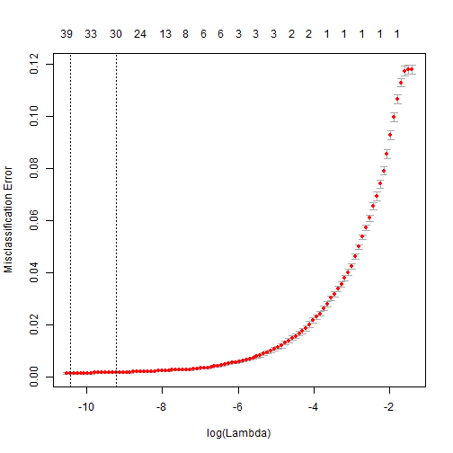

About a year ago, I naively entered a data hackathon hosted by a loan company. I had no experience with machine learning algorithms and I was only somewhat comfortable programming in R. We were given 6 hours to build the best model we can to decide whether or not to grant a loan to an individual based on information in a labelled training set. In short, it was a disaster; with only about 30 minutes left in the hackathon, I was still in the data cleanup stage! 

Since then, I've completed [several ML/AI graduate courses](http://melodyyin.github.io/courses/) where I completed assignments using popular algorithms, and I've also been using R regularly both within courses and on my own time. So, I thought this dataset would be well-suited for learning new algorithms and reviewing old ones! In the following post, I will be implementing logistic regression.

~


The training data set was made up of 70 categorical and numerical variables. I looked through the list and determined that 4 of them can be dropped because they have to do with physical location and not personal attributes. The final decision is in the `loan_status` column, which I will convert to a binary value and call the new column `decision`.


```r
library(dplyr)
train = read.csv("training.csv", sep=";")
train$decision = as.numeric(as.factor(train$loan_status)) - 1  # convert to binary
train = select(train, -id, -addr_city, -addr_state, -emp_title, -loan_status) # drop irrel vars
str(train)
```

```
## 'data.frame':	27356 obs. of  66 variables:
##  $ home_ownership                : Factor w/ 5 levels "MORTGAGE","NONE",..: 5 4 5 1 5 5 5 5 4 1 ...
##  $ purpose                       : Factor w/ 13 levels "car","credit_card",..: 3 3 2 3 2 3 3 6 2 3 ...
##  $ term                          : Factor w/ 2 levels " 36 months"," 60 months": 1 2 1 1 1 1 1 1 2 1 ...
##  $ annual_inc                    : num  41200 67000 34000 72000 32640 ...
##  $ is_inc_v                      : Factor w/ 3 levels "Not Verified",..: 2 3 1 1 2 3 2 1 2 1 ...
##  $ acc_now_delinq                : int  0 0 0 0 0 0 0 0 0 0 ...
##  $ acc_open_past_24mths          : int  3 9 4 NA NA 2 7 4 1 10 ...
##  $ bc_open_to_buy                : int  11028 9319 150 NA NA 3177 1119 244 13904 17007 ...
##  $ percent_bc_gt_75              : num  33.3 42.9 100 NA NA 33.3 83.3 100 66.7 42.9 ...
##  $ bc_util                       : num  55.4 58 96.2 NA NA 37.7 90.5 98.8 61.2 54.9 ...
##  $ dti                           : num  19.34 9.49 9.18 25.82 7.76 ...
##  $ delinq_2yrs                   : int  0 0 0 0 0 0 0 0 1 0 ...
##  $ delinq_amnt                   : int  0 0 0 0 0 0 0 0 0 0 ...
##  $ inq_last_6mths                : int  0 1 1 3 0 2 1 2 2 0 ...
##  $ mths_since_last_delinq        : int  32 NA 41 NA NA 35 45 NA 8 76 ...
##  $ mths_since_last_record        : int  NA NA NA NA NA 112 NA NA NA NA ...
##  $ mths_since_recent_inq         : int  15 5 0 NA NA 2 2 0 0 13 ...
##  $ mths_since_recent_revol_delinq: int  32 NA 41 NA NA 35 45 NA 8 79 ...
##  $ mths_since_recent_bc          : int  14 5 14 NA NA 14 13 40 23 4 ...
##  $ mort_acc                      : int  0 1 0 NA NA 0 0 0 5 4 ...
##  $ open_acc                      : int  10 18 10 11 5 4 19 13 5 20 ...
##  $ pub_rec                       : int  0 0 0 0 0 1 0 0 0 0 ...
##  $ total_bal_ex_mort             : int  24349 20781 25584 NA NA 2484 74606 45528 21914 41301 ...
##  $ revol_bal                     : int  14160 12991 3850 10131 7572 2484 19607 20857 21914 21547 ...
##  $ revol_util                    : Factor w/ 1020 levels "","0%","0.10%",..: 498 331 622 223 902 349 674 743 553 297 ...
##  $ total_bc_limit                : int  24700 22200 4000 NA NA 5100 11800 20400 35818 37700 ...
##  $ total_acc                     : int  17 27 21 36 20 14 35 23 20 47 ...
##  $ total_il_high_credit_limit    : int  19315 9500 27723 NA NA 0 NA 24051 0 35487 ...
##  $ num_rev_accts                 : int  16 24 4 NA NA 14 NA 10 12 32 ...
##  $ mths_since_recent_bc_dlq      : int  NA NA 57 NA NA 67 NA NA 8 NA ...
##  $ pub_rec_bankruptcies          : int  0 0 0 0 0 1 0 0 0 0 ...
##  $ num_accts_ever_120_pd         : int  0 0 1 NA NA 1 NA 0 0 2 ...
##  $ chargeoff_within_12_mths      : int  0 0 0 0 0 0 0 0 0 0 ...
##  $ collections_12_mths_ex_med    : int  0 0 0 0 0 0 0 0 0 0 ...
##  $ tax_liens                     : int  0 0 0 0 0 0 0 0 0 0 ...
##  $ mths_since_last_major_derog   : int  NA NA 57 NA NA 35 NA NA NA 76 ...
##  $ num_sats                      : int  10 18 10 NA NA 4 NA 13 5 20 ...
##  $ num_tl_op_past_12m            : int  1 4 0 NA NA 0 NA 2 0 3 ...
##  $ mo_sin_rcnt_tl                : int  5 2 14 NA NA 14 NA 4 23 4 ...
##  $ tot_hi_cred_lim               : int  46715 44600 33823 NA NA 6400 NA 52151 445486 99687 ...
##  $ tot_cur_bal                   : int  24349 20781 25584 NA NA 2484 NA 45528 413944 41301 ...
##  $ avg_cur_bal                   : int  2705 1484 2843 NA NA 621 NA 3502 82789 2295 ...
##  $ num_bc_tl                     : int  12 11 3 NA NA 8 NA 5 8 15 ...
##  $ num_actv_bc_tl                : int  6 5 1 NA NA 2 NA 4 2 5 ...
##  $ num_bc_sats                   : int  7 7 2 NA NA 3 NA 4 3 7 ...
##  $ pct_tl_nvr_dlq                : num  94 100 86 NA NA 69 NA 100 90 95.7 ...
##  $ num_tl_90g_dpd_24m            : int  0 0 0 NA NA 0 NA 0 0 0 ...
##  $ num_tl_30dpd                  : int  0 0 0 NA NA 0 NA 0 0 0 ...
##  $ num_tl_120dpd_2m              : int  0 0 0 NA NA 0 NA 0 0 0 ...
##  $ num_il_tl                     : int  1 2 17 NA NA 0 NA 13 2 11 ...
##  $ mo_sin_old_il_acct            : int  34 146 156 NA NA NA NA 148 73 160 ...
##  $ num_actv_rev_tl               : int  8 6 1 NA NA 3 NA 6 2 8 ...
##  $ mo_sin_old_rev_tl_op          : int  117 427 140 NA NA 222 NA 169 189 343 ...
##  $ mo_sin_rcnt_rev_tl_op         : int  5 2 14 NA NA 14 NA 4 23 4 ...
##  $ total_rev_hi_lim              : int  27400 35100 6100 NA NA 6400 NA 28100 38318 64200 ...
##  $ num_rev_tl_bal_gt_0           : int  8 6 1 NA NA 3 NA 6 2 8 ...
##  $ num_op_rev_tl                 : int  9 17 3 NA NA 4 NA 9 4 19 ...
##  $ tot_coll_amt                  : int  0 0 3639 NA NA 0 NA 0 0 0 ...
##  $ grade                         : Factor w/ 7 levels "A","B","C","D",..: 2 4 3 1 1 3 4 4 3 2 ...
##  $ sub_grade                     : Factor w/ 35 levels "A1","A2","A3",..: 7 16 11 1 4 14 19 19 15 6 ...
##  $ emp_length                    : Factor w/ 12 levels "< 1 year","1 year",..: 7 3 10 1 4 11 3 8 4 3 ...
##  $ int_rate                      : Factor w/ 144 levels "10.16%","10.64%",..: 6 51 27 131 136 42 56 63 44 140 ...
##  $ loan_amnt                     : int  7200 15000 6000 2500 9000 8500 13100 2500 24000 15000 ...
##  $ installment                   : num  236.2 378.9 206 76.1 281.6 ...
##  $ npv                           : num  368.6 3812.9 601.9 -61.8 24 ...
##  $ decision                      : num  1 1 1 1 1 0 1 1 1 1 ...
```

It looks like `revol_util` and `int_rate` are percentages, so let's make these numeric and R won't mistake them for factors. `emp_length` can remain a factor. Also, there are a lot of missing values in the data. We can remove these rows or try to substitute reasonable numbers for them.


```r
train$revol_util = as.numeric(strsplit(as.vector(train$revol_util), "%"))
train$int_rate = as.numeric(strsplit(as.vector(train$int_rate), "%"))
col_nas = apply(train, 2, function(x) sum(is.na(x)))
summary(col_nas)
```

```
##    Min. 1st Qu.  Median    Mean 3rd Qu.    Max. 
##       0       0    2528    4729    7433   25150
```

Ok, quite a lot of NAs in this dataset. If we were to get rid of all of the rows, then only 2207 would remain. However, we can keep all of our observations if we remove the columns with missing values so that only 26 columns remain. We could also perform imputation using k-nearest neighbors for the variables that are only about 10% missing, but risk adding bias to the training set otherwise.  


```r
train = select(train, one_of(names(which(col_nas==0))))
```

25 explanatory variables is still quite a lot. I remember at the hackathon, I spent quite a bit of time thinking about how to combine several variables together. Now, I know that is called features engineering (*here is a reminder to myself to come back to this at the end of my algorithms exploration*). For this exercise, I first tried stepwise regression using forward selection. However, the full model, using all 25 variables, never converged. So, I looked to lasso regression, which penalizes the size of the coefficients and allows for improved variable selection as well as regression. A paper I found helpful in understanding lasso regression was [this one](http://statweb.stanford.edu/~tibs/lasso/lasso.pdf) by Tibshirani.

The **glmnet** library implements logistic regression with the lasso penalty in R. Tibshirani is also one of the authors of the package. The vignette can be found [here](http://web.stanford.edu/~hastie/glmnet/glmnet_alpha.html). 

We now currently have 5 columns that are categorical. I don't believe glmnet transforms factors to dummies, so I will do this manually to be safe. However, each factor has several levels, but we can try to see if some can be dropped/manipulated. 

It looks like `is_inc_v` can be binary (verified or not) and `sub_grade` can be dropped without losing much information, since `grade` is still a valid column. For `purpose`, I will group the reasons into mandatory (credit card payments, debt conslidation, medical expenses, starting a small business), personal expenses (home improvement, major purposes, vacation, wedding) and unsure (all else). 


```r
train$is_inc_v_new = sapply(train$is_inc_v, function(x) as.integer(x!="Not Verified")) # 0 = Not Verified, 1 = Verified
train = select(train, -is_inc_v, -sub_grade)
purposes_lookup = data.frame(purpose=levels(train$purpose), new_purpose=c("Unsure", "Mandatory", "Mandatory", "Personal", "Unsure", "Personal", "Mandatory", "Unsure", "Unsure", "Unsure", "Mandatory", "Personal", "Personal"))
train %>% 
  left_join(purposes_lookup, by="purpose") %>% 
  select(-purpose) -> train 
response_loc = match("decision", names(train))
full = as.formula(paste("~", paste(names(train)[-response_loc], collapse="+")))
```

To find the lambda parameter, glmnet has a function to perform cross-validation fit using misclassification error as criteria (other options were: deviance, AUC, MSE/MAE). Since the coefficients are in log odds, we can translate them to odds so they are easier to understand. 


```r
library(glmnet)
```

```
## Warning: package 'glmnet' was built under R version 3.2.2
```

```
## Warning: package 'foreach' was built under R version 3.2.2
```

```r
x = model.matrix(full, train)[,-1] # predictor
y = as.factor(train$decision) # response
set.seed(2015-08-28)
cvfit = cv.glmnet(x, y, family="binomial", type.measure="class") # 10-fold
plot(cvfit)
```

 

```r
res = as.matrix(coef(cvfit, s="lambda.min"))
comb = data.frame(var=rownames(res), log_odds=res[,1], odds=exp(res[,1]))
comb = filter(comb, odds!=1)
arrange(comb, desc(odds))
```

```
##                           var      log_odds         odds
## 1                 (Intercept)  4.289762e+00 72.949081415
## 2           emp_length4 years  9.782212e-01  2.659720993
## 3                is_inc_v_new  8.740717e-01  2.396649348
## 4           emp_length5 years  7.358465e-01  2.087248095
## 5  collections_12_mths_ex_med  5.498203e-01  1.732941584
## 6                     pub_rec  3.805494e-01  1.463088137
## 7           emp_length8 years  3.506126e-01  1.419937141
## 8           emp_length2 years  2.662875e-01  1.305110249
## 9           emp_length3 years  2.489033e-01  1.282617991
## 10          emp_length7 years  2.142464e-01  1.238927869
## 11                     gradeB  2.136515e-01  1.238191043
## 12       pub_rec_bankruptcies  6.732947e-02  1.069647833
## 13                  total_acc  2.335818e-02  1.023633117
## 14                        npv  4.543867e-03  1.004554206
## 15                  loan_amnt  3.140351e-03  1.003145287
## 16                delinq_amnt  1.613549e-05  1.000016136
## 17                 annual_inc  1.016195e-05  1.000010162
## 18                  revol_bal -1.437876e-05  0.999985621
## 19           emp_length1 year -1.621514e-02  0.983915614
## 20                   int_rate -2.425129e-02  0.976040409
## 21                   open_acc -7.280012e-02  0.929786660
## 22                installment -9.363136e-02  0.910618388
## 23          new_purposeUnsure -1.163533e-01  0.890160671
## 24        emp_length10+ years -1.666287e-01  0.846513856
## 25                     gradeC -1.888532e-01  0.827908061
## 26        new_purposePersonal -1.940477e-01  0.823618652
## 27          emp_length9 years -1.979917e-01  0.820376646
## 28                delinq_2yrs -2.274391e-01  0.796570893
## 29             inq_last_6mths -2.403035e-01  0.786389178
## 30                     gradeD -2.950646e-01  0.744483528
## 31         home_ownershipRENT -3.395338e-01  0.712102261
## 32                     gradeF -4.225886e-01  0.655348178
## 33              emp_lengthn/a -4.724020e-01  0.623502837
## 34          home_ownershipOWN -4.964288e-01  0.608700591
## 35                     gradeE -5.348976e-01  0.585729256
## 36   chargeoff_within_12_mths -9.919212e-01  0.370863490
## 37             term 60 months -5.426019e+00  0.004400579
## 38                     gradeG -6.337515e+00  0.001768692
```

It seems that the variables individually have very small contribution to whether or not a loan is repaid. But, we see that having the lowest loan grade and a 60-month term each are characteristics that point to higher likelihood that the creditor will not receive repayment. 

While it would be great to test out this model with the validation set, I don't have the labelled version. However, I can get an estimate of the accuracy with cross-validation. 


```r
amt = round(nrow(x) * 0.9) # train only on 90% of data
indic = sample(1:nrow(x), amt) # "shuffle" rows 
xtrain = x[indic,]
xtest = x[-indic,]
ytrain = y[indic]
ytest = y[-indic]
cvfit2 = cv.glmnet(xtrain, ytrain, family="binomial", type.measure="class")
predictions = predict(cvfit2, newx=xtest, type="class", s=cvfit2$lambda.min)
table(predictions)
```

```
## predictions
##    0    1 
##  331 2405
```

```r
sum(predictions==ytest) / length(ytest) 
```

```
## [1] 0.999269
```

Using 10% of the training set as validation, we have a near perfect accuracy rate of 99.93 %. This is extremely high, so I'm a little bit skeptical of the results; possibly, my model went wrong somewhere, the model overfit on the training set, or the least likely option which is that logistic regression is a great fit for the dataset. Hopefully, I will have a better idea of the cause once I experiment with a few other methods. 
