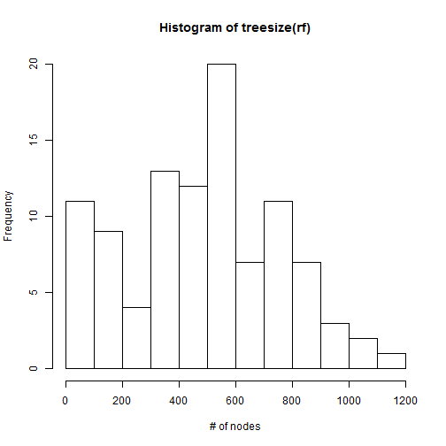

Random forests are made up of multiple decision trees (it's a *forest*). Each tree gets a *random* subset of the full training set (i.e., bootstrap aggregation aka "bagging") and each node gets split on the best choice out of another *random* subset of features. Once all the trees are... grown(?), all the trees take a vote on what the right answer should be. Decision trees tend to overfit on the training data, but random forests corrects this. 

**randomForest** is the package I will be using below. From the [cran page](https://cran.r-project.org/web/packages/randomForest/index.html) it seems that this package is directly adapted from the original random forest algorithm. The cleaned dataset (`train`), including the predictor matrix (`x`) and response vector (`y`), from the [Logistic Regression statscapade](http://melodyyin.github.io/statscapades/logistic.html) will be loaded.


```r
library(randomForest)
```

```
## Warning: package 'randomForest' was built under R version 3.2.2
```

```r
set.seed(2015-08-29)
rf = randomForest(x, y, ntree=100)
```

First, we can visualize the sizes of the trees in the forest. 


```r
hist(treesize(rf), xlab="# of nodes")
```

 

These are quite large trees! I'm assuming that the sizes of the trees are related to the number of predictors. In this case, there are 43 in the cleaned training set. 

A cool thing about randomForest is that it is able to calculate the variable importances, which is a straightforward way to understand which predictors are the most relevant. I am hesitant to extend the variable importances derived using this method to other models, however. 

randomForests ranking by 2 error rates. The first, `MeanDecreaseAccuracy`, is the average of the differences of the out-of-bag (OOB) error estimate with the variable and without for all `ntrees`. So, it makes sense that if a variable is more important, changing it would have a significant effect on the results. `MeanDecreaseGini` is the variable's total decrease in node impurity measured by the gini impurity criterion. 

Here are the top 5 most important variables by each of the measures: 


```r
imp = data.frame(var=rownames(importance(rf)), importance(rf))
imp_mda = arrange(imp, desc(MeanDecreaseAccuracy))
```

```
## Error in eval(expr, envir, enclos): object 'MeanDecreaseAccuracy' not found
```

```r
head(select(imp_mda, var, MeanDecreaseAccuracy), 5)
```

```
## Error in select_(.data, .dots = lazyeval::lazy_dots(...)): object 'imp_mda' not found
```

```r
imp_mdg = arrange(imp, desc(MeanDecreaseGini))
head(select(imp_mdg, var, MeanDecreaseGini), 5)
```

```
##          var MeanDecreaseGini
## 1        npv       4812.14906
## 2 annual_inc         95.88602
## 3   int_rate         94.42232
## 4        dti         91.20263
## 5  revol_bal         74.25870
```

It's interesting to note that only 1/5 of the most important variables by OOB error can be considered influential by the logistic regression model, while the rest have odds hovering around 1 (i.e., the odds of success is 1:1). The top 5 by Gini index have similar results; one of the predictors (`dti`) was actually dropped by the lasso. `npv` and `annual_inc` are, by far, the two most important variables for both measures. 

Another cool feature of randomForests is that it can calculate the proximity matrix of the dataset. The proximity matrix is `N`x`N` where `N` is the size of the training set. For each tree, if two rows end up in the same terminal node, then their proximity value increases by one. At the end, this value is normalized by the number of trees. Unfortunately, training on all 27356 rows exceeds the memory capacity of my laptop, so I will use a subset of the training set to find any outliers. 


```r
indic = sample(1:nrow(x), 1000) # select 1000 random rows
xsub = x[indic,]
ysub = y[indic]
rf_sub = randomForest(xsub, ysub, ntree=100, proximity=TRUE)
rf_sub_prox = rf_sub$proximity
rf_sub_outliers = outlier(rf_sub_prox)
quantile(round(rf_sub_outliers, 4), probs=seq(0,1,0.05))
```

```
##        0%        5%       10%       15%       20%       25%       30% 
## -1.249500 -0.902010 -0.782330 -0.697670 -0.626660 -0.549400 -0.464120 
##       35%       40%       45%       50%       55%       60%       65% 
## -0.364970 -0.244060 -0.147100  0.000000  0.169980  0.380960  0.595990 
##       70%       75%       80%       85%       90%       95%      100% 
##  0.898530  1.256050  1.824740  3.501115  8.184070 11.124580 23.012900
```

By this output, we can conclude that about 10-15% of the data can be considered outliers. It's reassuring that not all of the data is homogenous, because that would be a signal that the training data is biased. 

And finally, we rebuild the model on 90% of the data and test on the remaining 10%.


```r
amt = round(nrow(x) * 0.9) # train only on 90% of data
indic = sample(1:nrow(x), amt) # "shuffle" rows 
xtrain = x[indic,]
xtest = x[-indic,]
ytrain = y[indic]
ytest = y[-indic]
res = randomForest(xtrain, ytrain, xtest=xtest, ytest=ytest, ntree=100)
pred = res$test$predicted
sum(pred == ytest) / length(ytest)
```

```
## [1] 0.999269
```

The accuracy rate is again extremely high. It's actually identical to the rate I got using logistic regression, even though the test set is composed of different rows and the two methods ranked variables differently.

Perhaps I'll shoot the loan company an email and get that validation set...
