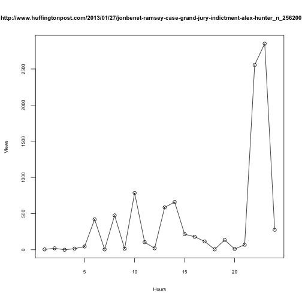

Hello (R Markdown) World! I had heard of **knitR** before, but never really had a use for it until recently, when I started to work on data challenges as part of the data scientist interview process. Using knitR to weave my analyses and code in an elegant report format is much better than what I was doing before, which was making comments in the code itself or having a separate document file to hold all of my plots and explanations. 

Below, I am going to redo a data challenge that was assigned to me a few weeks ago. I will be using knitR and the **dplyr** package (I was using base functions previously) to get some practice working with both. 

A short introduction to the challenge: I was given 2 large json bz2 files (~5GB total), an explanation of the variables, and several questions to answer. The biggest challenge I faced was trying to import the data into R or Python. After unsuccessfully trying to load the larger data file (~3GB) using **rjson** and **jsonlite**, I switched over to Python's **json** module. I like to do my data analyses in R, so I saved the relevant variables as text files, and loaded them into R. I'm sure this isn't the most efficient way, so let me know if there is a better way to do this. I did try making another json file with the variables I needed, but the resulting file was actually slightly larger than the separate .txt files.

~


The first task was to find the top 5 largest users 


```r
userids = scan("userids.txt", n=5000000, sep="\n", blank.lines.skip=FALSE) 
totals = scan("totals.txt", n=5000000, sep=",", blank.lines.skip=FALSE)
totals = na.omit(totals) # weird trailing NA
df = data.frame(userids, totals)
rm(userids, totals)

q1 = function()
{
  df %>% 
    group_by(userids) %>%
    summarise(sumtotal=sum(totals)) %>%
    arrange(desc(sumtotal)) %>%
    head(5)
}
q1() 
```

```
## Source: local data frame [5 x 2]
## 
##   userids  sumtotal
## 1   10032 517321885
## 2  133584 419299045
## 3   56957 100528250
## 4   55449  63637530
## 5  132574  58499855
```

Then, for each user, find the top 5 posts 


```r
urls = scan("urls.txt", n=5000000, what="character", sep="\n", blank.lines.skip=FALSE)
df$urls = urls
rm(urls)

q2 = function(id)
{
  df %>%
    filter(userids==id) %>%
    group_by(urls) %>%
    summarise(sumtotal=sum(totals)) %>%
    arrange(desc(sumtotal)) %>%
    head(5)
}
q2(10032)
```

```
## Source: local data frame [5 x 2]
## 
##                                                                                                             urls
## 1                                 http://www.huffingtonpost.com/2013/01/22/michelle-obama-boehner_n_2529107.html
## 2                                http://www.huffingtonpost.com/2013/01/21/michelle-obama-eye-roll_n_2522136.html
## 3                http://www.huffingtonpost.com/2013/01/15/gene-rosen-sandy-hook-conspiracy-theory_n_2481912.html
## 4 http://www.huffingtonpost.com/2013/01/27/jonbenet-ramsey-case-grand-jury-indictment-alex-hunter_n_2562007.html
## 5                               http://www.huffingtonpost.com/2013/01/25/sarah-palin-fox-news-out_n_2553421.html
##   sumtotal
## 1  1433980
## 2  1377550
## 3  1334570
## 4  1324645
## 5  1221105
```

```r
#and so on for 133584, 56957, 55449, 132574
```

Next, make 25 plots of the hourly traffic for each of the above links (I'll just show the ones for the most visited site)


```r
hours = matrix(scan("hours.txt"), ncol=24)
df = cbind(df, hours)
rm(hours)

# key here is that urls are not unique
q3 = function(id)
{
  top5links = as.character(q2(id)$urls) # o.w. levels takes too long
  df %>%
    filter(urls %in% top5links) %>% # should cover userids as well
    group_by(urls) %>%
    summarise_each(funs(sum), 4:27)
}

q3plot = function(x)
{
  par(ps=8)
  plot(x[2:25], main=x[1], xlab="Hours", ylab="Views") 
  lines(x[2:25])
}

apply(q3(10032), 1, q3plot)
```

     

```r
# etc
```
Then, for each of the 5 top users, find the post with more than 15k views that peaked the latest, and if there were more than 1 post that fulfills these conditions, the one with the most views should be displayed


```r
q4 = function(id)
{
  q4df = df %>%
    group_by(urls, userids) %>%
    summarise_each(funs(sum), 4:27)
  q4df$sumtotals = rowSums(q4df[,3:26])
  q4df = filter(q4df, sumtotals>=15000 & userids==id)
  q4df$pkhour = apply(q4df[,3:26], 1, which.max)
  q4df$pkvisit = apply(q4df[,3:26], 1, max)
  
  maxh = max(q4df$pkhour)
  
  if (sum(q4df$pkhour==maxh) > 1)
  {
    maxdf = filter(q4df, pkhour==maxh)
    i = which.max(maxdf$pkvisit)
    select(maxdf[i,], urls, userids)
  }
  else
  {
    select(q4df[max(q4df$pkhour),], urls, userids)
  }
}

do.call(rbind, lapply(q1()$userids, q4))
```

```
## Source: local data frame [5 x 2]
## Groups: urls
## 
##                                                                                                                                               urls
## 1                                                                                 http://www.huffingtonpost.com/kenna/reaching-bono_b_2412479.html
## 2 http://www.dailymail.co.uk/news/article-2254845/Kate-Middleton-Pregnant-Now-family-launch-newborn-baby-range-wake-daughters-royal-pregnancy.html
## 3                   http://www.usmagazine.com/celebrity-style/pictures/supermodel-catwalk-style-vs-sidewalk-style-which-look-is-best-2013251/27856
## 4                                                                        http://www.cracked.com/blog/the-5-types-sociopath-invented-by-internet_p2
## 5                       http://www.foxnews.com/entertainment/2013/01/21/katie-couric-wins-manti-teo-sweepstakes-will-have-notre-dame-star-on-show/
##   userids
## 1   10032
## 2  133584
## 3   56957
## 4   55449
## 5  132574
```

The next task was to write explanations for why each of the 5 links from previous question peaked late. I'm not going to go through each of the link, but here are three potential reasons for why a page could peak at one hour and generate relatively low traffic for another hour: (1) Someone high-profile shared it (ex. if a celebrity shared a link on their twitter page, it would generate high traffic for the hour or so before and after the tweet was posted) or a popular site advertised it on their front page (ex. it rose to the top of the Facebook Trending....area or it was posted to the front page of Yahoo!) (2) In general, pages should get more traffic before/after school or work hours, assuming that non-school/non-work related internet usage is very limited during hours 9-17 (3) As pages are being shared, I think there should be a "tipping point" when the rate that it spreads through a network picks up (and then drops back down again after the large group finishes reading it). And an obvious reason for why a certain site had no traffic for a portion of the day is that the page wasn't posted until the first hour that it had activity.

The final task is to make a plot with the average hourly traffic for all posts with 15k views or greater from all partners with error bars. 


```r
q5 = function()
{
  q5df = df %>%
    group_by(urls) %>%
    summarise_each(funs(sum), 4:27)
  q5df$sumtotals = rowSums(q5df[,2:25])
  q5df = filter(q5df, sumtotals>=15000)
  res = colSums(q5df[,2:25]) / nrow(q5df)

  plot(1:24, res, ylim=c(500, max(res)+500), main="Average Total Hourly Traffic, Posts With >=15k Views", xlab="Hour", ylab="Views")
  lines(res)
  segments(1:24, res-sd(res), 1:24, res+sd(res))
}
q5()
```

 

And done! 
